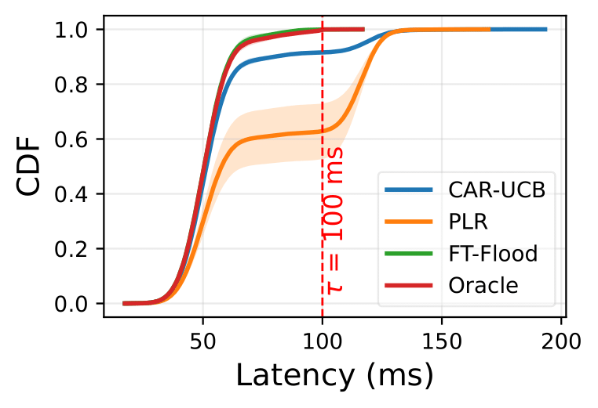
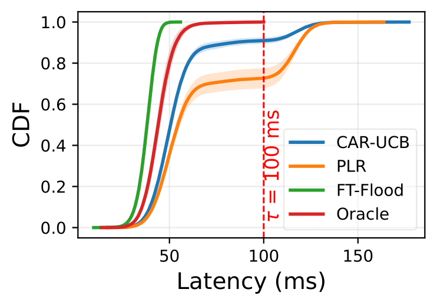
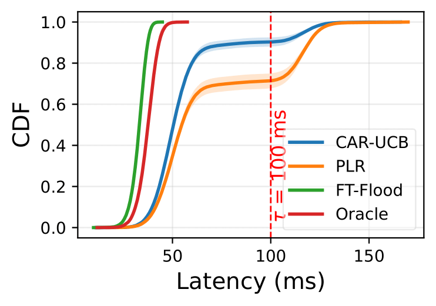
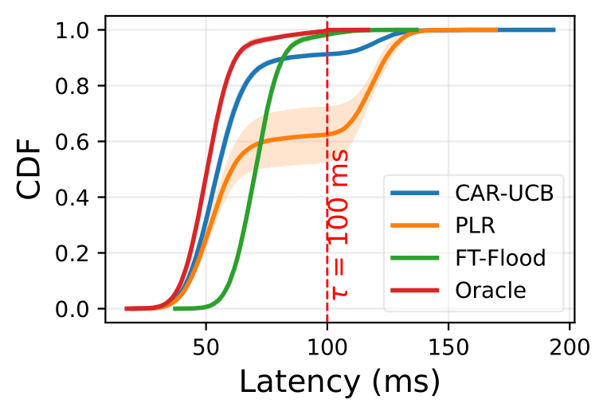
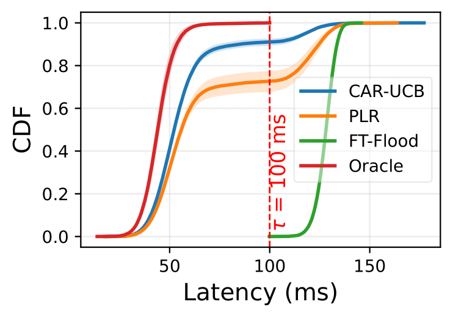
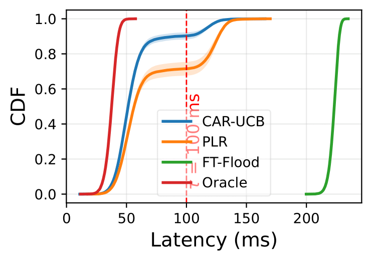
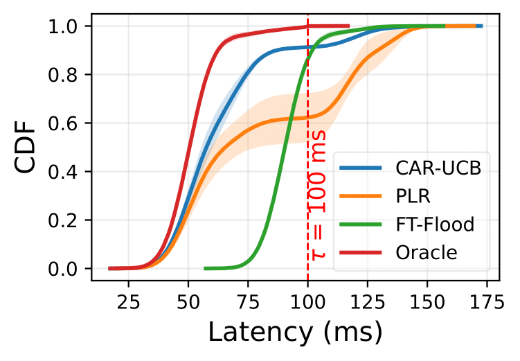
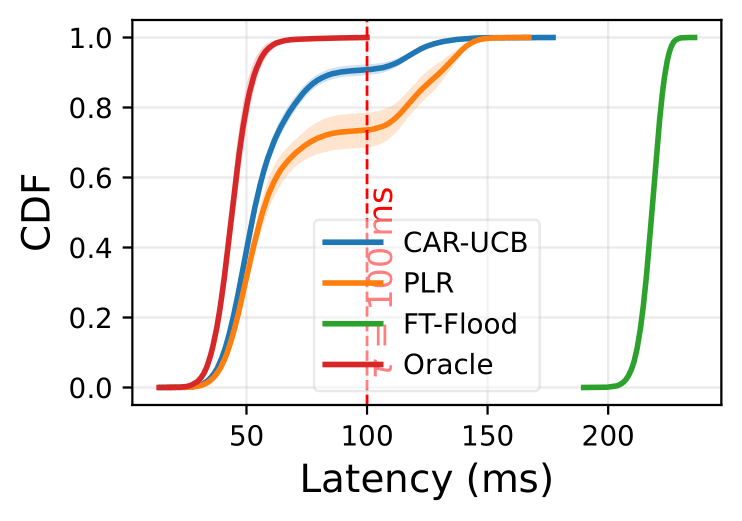
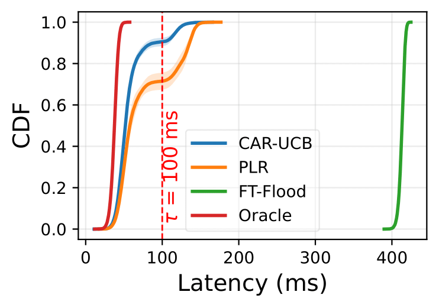

# car-ucb

## Installation

### Prerequisites
- Python 3.10 
- pip

### Steps

1. Clone the repository:
   ```bash
   git clone https://github.com/anonymous-123qh/car-ucb.git
   cd car-ucb
2. Install packages:
   ```bash
    pip install -r requirements.txt
    ```
## Usage and Reproduce Results
### Running the Simulator

Execute the main simulation script, passing the critical parameters for the system configuration.

| Parameter | Description | Default / Paper Value |
| :--- | :--- | :--- |
| `--num-interfaces` | The number of network interfaces/links available ($M$). | `2` (Small), `5` (Medium), `10` (Large) |
| `--num-servers` | The number of processing servers available ($N$). | `3` (Small), `10` (Medium), `20` (Large) |
| `--horizon` | Total number of time steps to run the simulation ($T$). | `5000` |
| `--congestion-penalty` | Latency penalty added when multiple paths contend for the same interface. | `30` |
| `--num-trials` | Number of independent trials. | `20`  |

```bash
python main_simulator.py \
    --num-interfaces 2 \
    --num-servers 3 \
    --horizon 5000 \
    --congestion-penalty 30 \
    --num-trials 20
```
### Plotting Results
After successfully running the simulator, the data will be saved to the data_output directory.

#### CDF latency plot: 
   Run, e.g., to draw a shaded latency plot for experiments with #interface 2, #server 3
  ```
  python shaded_latency_plot.py \
    --num-interfaces 2 \
    --num-servers 3
  ```
          
### Regret plot:
  Run, e.g., to draw a regret plot for experiments with #interface 2, #server 3
  ```
  python regret_plot.py \
    --num-interfaces 2 \
    --num-servers 3
  ```
### Ground-truth network dynamics and algorithms'decision plot:
  Run , e.g., to draw  for experiments with #interface 2, #server 3
  
  ```
  python qualitative_plot.py \
    --num-interfaces 2 \
    --num-servers 3
  ```
### Multiple-agent decision plot:
1. Run the experiment with
 ```
 python multiple_car_ucb_multiple_seed.py \
   --num-interfaces 2 \
   --num-servers 3
 ```
3. Draw the plot result
```
python herd_avoidance_analyse.py 
```

## Ablation test with different congestion penalty
1. Congestion penalty = 0, scale from left to right: K =6, 50, 200.
<p align="center">
  
  
  
</p>
2. Congestion penalty = 10, scale from left to right: K =6, 50, 200.
<p align="center">
  
  
  
</p>
3. Congestion penalty = 20, scale from left to right: K =6, 50, 200.
<p align="center">
  
  
  
</p>
       
